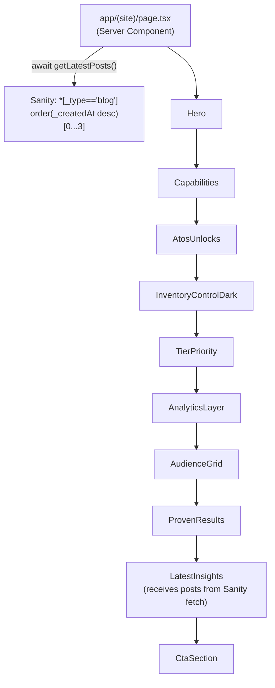

# Homepage Flow

Source: `app/(site)/page.tsx`, sections in `app/(site)/_components/`.

The homepage is a Server Component. It fetches the 3 most recent blog posts from Sanity
(`getLatestPosts`) and renders ten sections top-to-bottom, in order. Client-rendered pieces are
limited to the `Header`'s mobile menu, `Reveal` (scroll-triggered fade/slide-up, via framer-motion
`whileInView`), and `DarkFeatureCard`'s animated progress bar.

Typography, spacing and color tokens (`carbon`, `graphite`, `steel`, `off-white`, `surface-dark`,
`accent` #FF6A00) are matched against the production RAMS site's rendered output — see
`app/globals.css` for the token definitions and the `.shine-card` / `.ticker-track` animation
utilities used by feature cards and the hero's reconciliation feed.

## Render order

## Section-by-section

| # | Component | id | Background | Purpose | Reused pieces |
| - | --- | --- | --- | --- | --- |
| 1 | `Hero` | `#hero` | Dark radial gradient + orange glow + grid overlay | Headline (fluid 56/84/112px), tag pills, 2 CTAs, live "Zone B reconciliation" dashboard mockup with a pulsing exception marker and an auto-scrolling reconciliation feed ticker | `Badge`, `Button`, `DashboardFrame` |
| 2 | `Capabilities` | `#capabilities` | White | 6-card grid of product capabilities | `Eyebrow`, `FeatureCard` ×6 |
| 3 | `AtosUnlocks` | — | Off-white (#F5F5F7) | 3 numbered cards ("What ATOS Unlocks") | `Eyebrow`, `FeatureCard` ×3 (with `number`) |
| 4 | `InventoryControlDark` | `#inventory-control` | Dark radial gradient + orange glow | 3 cards with animated progress bars, middle one highlighted orange (dark text on orange, matching production) | `Eyebrow`, `DarkFeatureCard` ×3 |
| 5 | `TierPriority` | `#abc-analysis` | Dark radial gradient + orange glow | A/B/C inventory-tier cards, each with a tinted badge gradient (orange/indigo/emerald) | `Eyebrow`, `TierCard` ×3 |
| 6 | `AnalyticsLayer` | `#analytics-layer` | Dark radial gradient + orange glow | Dashboard mockup with 4 stat tiles + SVG area chart | `Eyebrow`, `DashboardFrame` |
| 7 | `AudienceGrid` | `#audience` | White | Eyebrow + heading + 4 cards, one per audience (inventory teams, ops, management, audit) | `Eyebrow`, `FeatureCard` ×4 (with `eyebrow`) |
| 8 | `ProvenResults` | `#proven-results` | Warm off-white | 6 stat cards (orange gradient-clipped numbers) with named customer sources | `Eyebrow`, `StatCard` ×6 |
| 9 | `LatestInsights` | `#insights` | White | 3 latest Sanity blog posts + link to `/blog`; renders nothing if there are no posts | `Eyebrow`, `BlogCard` ×3 |
| 10 | `CtaSection` | `#cta` | Dark radial gradient + orange glow | Closing headline (fluid 44/72/96px) + 2 CTAs (`mailto:` placeholders) | `Badge`, `Button` |

`Eyebrow` (`components/ui/Eyebrow.tsx`) is the plain mono/orange section label used above every
heading — distinct from `Badge`, which is reserved for the glass pill style used only in `Hero`
and `CtaSection`.

## Anchors used by the header nav

`components/Header.tsx` links to same-page anchors on the homepage:

- Solutions → `/#capabilities`
- Platform → `/#analytics-layer`
- Industries → `/#audience`
- Resources → `/blog` (separate route, not an anchor)
- Company → `/#proven-results`

## Data dependency

Only one section depends on external data: `LatestInsights`, fed by the single Sanity query in
`page.tsx`. Every other section renders static marketing copy defined inline in its own file —
there is no CMS-driven content for the marketing sections themselves.
